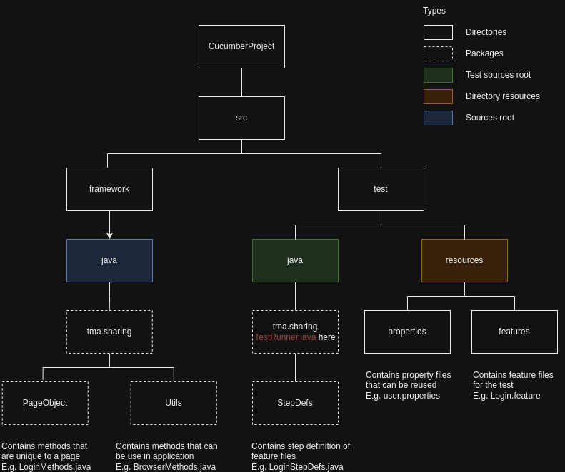

# Procedure to design new project

## Project setup
1. Create a Java project with Maven option
2. In **pom.xml**, add dependencies for Selenium, Selenium web driver manager, JUnit, Cucumber
3. Reload project to download dependencies
4. Make sure project is build successfully

## Create directories to separate files

## Create component files
1. Feature files (In src/test/resources/features)
2. Step definition files will be created manually or automatically from feature file (In src/test/java/tma/sharing/StepDefs)
3. Test runner file (In src/test/java)
- @RunWith(Cucumber.class)
- @CucumberOptions(): Contains features = {path to feature file} and plugin or something else you want to configure

## Write some tests for login feature
1. Write scenarios in feature file
2. Create step definition file from feature file
3. Write scrip for each step
4. There is one problem, we need to open browser and close it before and after its scenarios, so weed need to create a hook file and use @After, @Before hooks to handle it
5. Run the test
6. When extend ScenarioHooks created at step 4 for LoginStepDefs class, it is not allow because this is hook file, so we need to create another class like BrowserHandler to handle for opening and closing driver and call these functions in ScenarioHooks. Then back to StepDefs file and extend it from BrowserHandler

## Create object file
You can see in LoginStepsDefs at this moment, it has same way to enters text, click button,... 
So that why's we needing to create object file for reuse
1. Create object file in PageObjects
2. Define/Call them in suitable files

## Move on to Scenario Outline
1. Define Scenario outline and Examples
2. Use <> for variable in steps. E.g. *Given User enters an invalid \<username> in the username input*
3. In StepDefs, use regex and variable for method. E.g.\
*@Given("^User enters an invalid (.\*) in the username input$")*\
   public void userEntersAnInvalidUsernameInTheUsernameInput(String **username**) {\
   LoginPageObject.enterUsername(**username**);\
   }
4. Use | to define variable name and value for Examples in feature file

## Properties
1. Create needed property files
2. Create PropertiesHandler and use Properties to load them from FileInputStream class
3. Usage:\
   Properties properties = PropertiesHandler.loadCredentialProperties();\
   String username = properties.getProperty("username");\
   String password = properties.getProperty("password");\